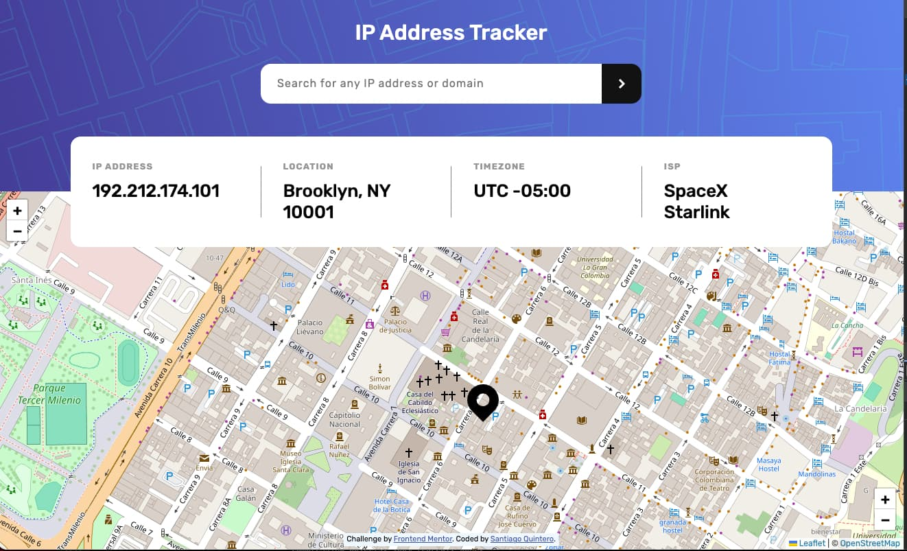

# Frontend Mentor - IP address tracker solution

This is a solution to the [IP address tracker challenge on Frontend Mentor](https://www.frontendmentor.io/challenges/ip-address-tracker-I8-0yYAH0). Frontend Mentor challenges help you improve your coding skills by building realistic projects. 

## Table of contents

- [Overview](#overview)
  - [The challenge](#the-challenge)
  - [Screenshot](#screenshot)
  - [Links](#links)
- [My process](#my-process)
  - [Built with](#built-with)
  - [What I learned](#what-i-learned)
  - [Continued development](#continued-development)
- [Author](#author)

## Overview

### The challenge

Users should be able to:

- View the optimal layout for each page depending on their device's screen size
- See hover states for all interactive elements on the page
- See their own IP address on the map on the initial page load
- Search for any IP addresses or domains and see the key information and location
- Perfect Pixel solution

### Screenshot

   
### Links

- Solution URL: [Add solution URL here](https://your-solution-url.com)
- Live Site URL: [Add live site URL here](https://santirockk.github.io/ip-address-tracker/)

## My process

### Built with

- Semantic HTML5 markup
- CSS
- Flexbox
- Mobile-first workflow
- Javascript

### What I learned

I learned to work with the Leaflet library, with the IP Geolocation API and the API Key best practices. 

### Continued development

I would like to further improve my skills in perfect pixel and react.

## Author

- Website - [Santiago Quintero](https://sqpweb.netlify.app/)
- Frontend Mentor - [@SantiRock](https://www.frontendmentor.io/profile/SantiRock)

